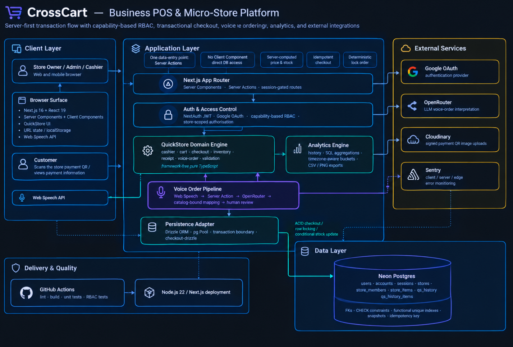
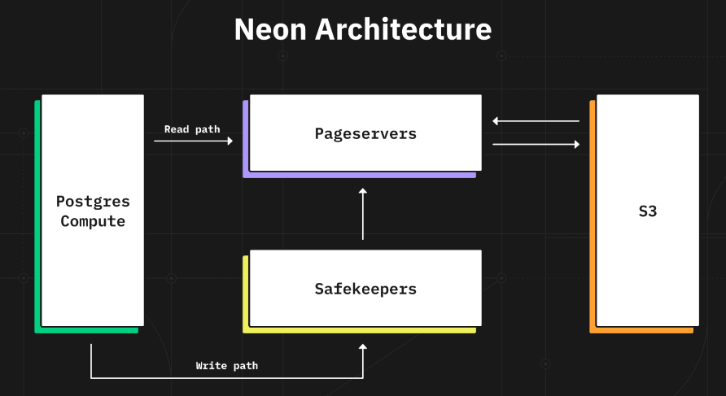
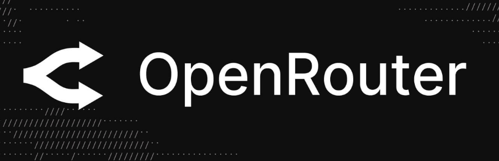
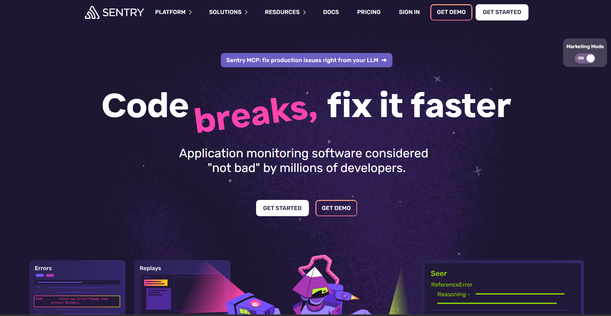

<p align="center">
  
</p>

<h1 align="center">CrossCart</h1>

<p align="center">
  <b>The quiet system behind busy businesses.</b><br/>
  A server-first <b>POS &amp; micro-store platform</b> — sell, track stock, run a team and read your own numbers<br/>
  inside one calm workspace built entirely on the Next.js App Router.
</p>

<p align="center">
  <a href="https://nextjs.org"></a>
  <a href="https://react.dev"></a>
  
  <a href="https://tailwindcss.com"></a>
  <a href="https://ui.shadcn.com"></a>
</p>

<p align="center">
  <a href="https://neon.tech"></a>
  <a href="https://orm.drizzle.team"></a>
  <a href="https://authjs.dev"></a>
  <a href="https://openrouter.ai"></a>
  <a href="https://cloudinary.com"></a>
  <a href="https://sentry.io"></a>
</p>

<p align="center">
  <a href="https://jestjs.io"></a>
  <a href="https://github.com/zannunakiz/CrossCart/actions"></a>
  
</p>

<p align="center">
  <i>Want to see it before reading a single line? — <code>/demo</code> runs the full cashier with <b>no login and no database</b>.</i>
</p>

---

## 🏗️ System Design

<p align="center">
  
</p>

<p align="center">
  <sub>
    <b>One request, end to end:</b> the browser → a Server Action (session → role → permission) → the pure domain layer
    → Neon Postgres through Drizzle → a typed envelope back to the UI.<br/>
    External providers stay outside the trust boundary: Google OAuth, OpenRouter, Cloudinary and Sentry.
  </sub>
</p>

---

## 📚 Table of Contents

| | Section |
|---|---|
| 🏗️ | [System Design](#-system-design) |
| 🧭 | [About](#-about) |
| 🖼️ | [Documentation Gallery](#-documentation-gallery) |
| ✨ | [Features](#-features) |
| 🧱 | [Tech Stack](#-tech-stack) |
| 🛠️ | [Engineering Highlights](#-engineering-highlights) |
| 🗂️ | [Project Structure](#-project-structure) |
| 🚀 | [Getting Started](#-getting-started) |
| 📜 | [Scripts](#-scripts) |
| 🧪 | [Tests &amp; CI](#-tests--ci) |
| 🤝 | [Contributing](#-contributing) |
| 📄 | [License](#-license) |

---

## 🧭 About

**CrossCart** is a free, multi-tenant **POS & micro-store console** — the operating system for a small business
that has no patience for POS software.

A store is created in seconds, becomes `open` or `closed` with one switch, and immediately has a **catalog**,
a **cashier**, a **revenue dashboard**, a **team with real roles** and a **payment QR** the customer scans.
Every business action — items, sales, members, settings — is one **Server Action** away, guarded by the same
permission matrix, on the same page the user is already looking at.

Three surfaces ship today:

| Surface | Route | What it is |
|---|---|---|
| **Landing & auth** | `/` | Product story, Google sign-in, theme + language switches, live "today at a glance" pulse |
| **QuickStore** | `/quickstore` → `/quickstore/[storeId]` | The product — stores, catalog, cashier, analytics, membership |
| **Demo Cashier** | `/demo` | The real cashier UI against a mocked catalog: no account, no DB, full flow |
| **Modern POS** | `/pos` | Parked roadmap surface (restaurant-grade register + KDS) — a deliberate placeholder |

---

## 🖼️ Documentation Gallery

> Full architecture, data model and invariants live in [`documentation/Overall.md`](./documentation/Overall.md)
> and [`documentation/Engineering.md`](./documentation/Engineering.md).

<p align="center">
  
</p>

### Data — Neon Postgres, modelled in code

<p align="center">
  
</p>

### Identity — NextAuth with the Drizzle adapter

<p align="center">
  
</p>

### Intelligence — OpenRouter free-models router behind a strict contract

<p align="center">
  
</p>

### Assets — signed Cloudinary uploads only

<p align="center">
  
</p>

### Observability — Sentry, wired through a first-party tunnel

<p align="center">
  
</p>

---

## ✨ Features

<table>
<tr><td width="50%" valign="top">

**🏪 Stores &amp; catalog**
- Create a store in one dialog (`name ≤ 20`, `description ≤ 50`, enforced in UI **and** DB)
- Soft delete — history survives for audit and dispute handling
- Items with price, discount (0–100%), tracked stock (0–999) or unlimited, availability toggle
- Case-insensitive unique names per store — a **database** index, not a hope
- Search, filter, sort (name / price / stock / sold / newest) and paging, all in SQL

**🧾 A cashier that cannot double-sell**
- Client idempotency key → a retried click returns the *original* receipt
- Prices recomputed server-side, money in integer cents
- `FOR UPDATE` row locks in deterministic order → no deadlock, no negative stock
- History + stock in one transaction; any failure rolls both back
- Stale-stock `409` answers with per-line issues and a one-click "refresh & clamp"

</td><td width="50%" valign="top">

**🎙️ Voice ordering (EN / ID)**
- Browser-native speech recognition — no key, no vendor, no audio upload
- LLM reads the whole sentence; every line is resolved back onto **real catalog rows**
- Speaks "dua sate dan satu soto", "fred rise two", "piscok" — glossary + homophones + plural recovery
- Deterministic rescue pass turns one dead sentence into its products
- Nothing enters the cart until a human confirms the review panel

**📊 Numbers that belong to the operator**
- Revenue / sales / items / discounts, top items, per-cashier performance, hour-of-day curve
- Buckets follow **their** timezone and day boundaries, computed in SQL
- Export the whole filtered range as CSV, or one receipt as CSV **and** a shareable PNG

**🔐 Real RBAC · 👥 Teams · 🌗 EN/ID · 📱 Mobile-first UX**
- Permission matrix instead of `if (role === "admin")` sprinkled everywhere
- Invite by email, promote, demote, remove — with owner protection
- Dark/light with no flash-of-wrong-theme, full Indonesian translation
- Mobile-first layouts, reduced-motion aware animation, toasts, URL-addressable views

</td></tr>
</table>

---

## 🧱 Tech Stack

**Application**

| Layer | Choice | Why it is here |
|---|---|---|
| Framework | **Next.js 16** (App Router, RSC) | One runtime for UI *and* backend: Server Components render data, Server Actions mutate it — no REST layer to keep in sync |
| UI runtime | **React 19** | `useSyncExternalStore` for the preference store, modern transitions and Suspense boundaries |
| Language | **TypeScript 5** (strict, `@/*` alias) | Domain types are inferred from the Drizzle schema — one source of truth from SQL to JSX |
| Styling | **Tailwind CSS v4** + `tw-animate-css` | Token-driven theme (light/dark) with zero runtime CSS |
| Components | **shadcn/ui** (`base-nova`) over **Base UI** primitives | Accessible, copy-owned components — keyboard behaviour included, no opaque dependency |
| Motion | **Framer Motion** | Entrance choreography that respects `prefers-reduced-motion` on every animated surface |
| Charts | **Recharts** via the shadcn chart layer | Responsive revenue/volume charts with themed tooltips |
| Icons / toasts | **lucide-react**, **sonner** | Icon set + toast queue |

**Data & identity**

| Layer | Choice | Why it is here |
|---|---|---|
| Database | **Neon Postgres** | Serverless Postgres with branching; the schema uses real relational guarantees (FKs, CHECKs, functional unique indexes) |
| ORM | **Drizzle ORM + drizzle-kit** | SQL-first types, `db.query` relations, and 14 incremental migrations under version control |
| Driver | **`pg` Pool** (`max: 10`, global-cached across HMR) | One connection pool per process instead of one per request |
| Auth | **NextAuth v4** + `@auth/drizzle-adapter`, Google OAuth, JWT sessions | Session identity resolved server-side, then passed through the RBAC layer |

**Platform & quality**

| Layer | Choice | Why it is here |
|---|---|---|
| AI | **OpenRouter** (`openrouter/free`), raw `fetch` | Pluggable model + zero SDK surface; the provider may change, our contract does not |
| Media | **Cloudinary** (signed, server-side uploads) | The API secret never reaches the browser; a 2 MB / image-only rule is enforced on both sides |
| Monitoring | **Sentry** (`@sentry/nextjs`, client + server + edge, `/monitoring` tunnel) | Errors land even behind ad-blockers; `onRequestError` captures App Router failures |
| Tests | **Jest 30 + ts-jest** | 9 suites / **170 cases** of pure domain and RBAC tests — no database, no network |
| CI | **GitHub Actions** — `lint`, `build`, `unit test`, `RBAC test` | Four independent, individually-required status checks |
| Fonts | **`next/font`** (Inter, JetBrains Mono, Source Serif 4) | Self-hosted, zero layout shift, mapped to CSS variables |

---

## 🛠️ Engineering Highlights

This is the part worth reading. Everything below is enforced by code, not by convention.

### 1. Server-first data flow — the API *is* the component tree

There is no public API to secure: the only route handler left is the auth one. Every read and write is a
**Server Action** under `lib/actions/**`, and each one independently re-establishes identity:

```
currentSession()  →  getUserRole(userId, storeId)  →  hasPermission(role, "…:…")  →  domain logic  →  Drizzle
    401 Unauthorized         guest → no role              403 Forbidden              pure rules        SQL
```

A Server Action still answers a plain POST, so **nothing about the caller is ever taken from the arguments** —
identity comes from the session cookie and the role is re-derived from the database on every call.
Failures return a typed envelope (`{ ok: false, error, status, code, issues }`) that preserves the HTTP
semantics the UI branches on.

### 2. Scalable RBAC — a permission matrix, not role checks

16 `resource:action` permissions (`store:*`, `member:*`, `item:*`, `sale:*`) live in one auditable file:

| Permission | Master | Admin | Guest |
|---|:--:|:--:|:--:|
| `store:view` · `store:update-status` | ✅ | ✅ | ❌ |
| `store:update-details` · `store:update-credential` · `store:delete` | ✅ | ❌ | ❌ |
| `member:view` · `item:*` · `sale:view` · `sale:create` | ✅ | ✅ | ❌ |
| `member:invite` · `member:update-role` · `member:remove` · `sale:void` | ✅ | ❌ | ❌ |

- Call sites never branch on a **role name** — a role gaining or losing a capability is a one-line matrix edit.
- The **same** matrix gates the UI (`hasPermission` → which tabs render), the **URL** (`?tab=` is rewritten when
  the role may not open it) and the **server** (each action re-checks): three views, one truth.
- The store owner is implicitly `master`; nobody may change their own membership; the owner row can never be
  re-roled or removed; a soft-deleted store answers "not found" on every path.
- Adding `staff` or `viewer`, or per-member permission overrides, is additive — no schema change, no rewrite.

### 3. The checkout engine — a sale that is impossible to get wrong

```
idempotent replay  →  FOR UPDATE (sorted ids)  →  validate + reprice  →  header + snapshot lines  →  conditional decrement
  same key = same receipt       no deadlocks          integer cents         one transaction            stock ≥ 0 always
```

- Money is never a float: UI → integer cents → `numeric(18,2)` → back to cents for display.
- A unique index on `client_request_id` means a double click, a retry, or a lost response **replays the original
  receipt** instead of selling twice.
- Receipt lines **snapshot** name, price and discount, and the cashier's display name is stored on the sale —
  editing or deleting an item or a user can never rewrite history.
- Receipt numbers are unique per store and retried on collision; stock decrement is guarded by SQL
  (`stocks is null or stocks >= qty`) even beyond the row lock; any failure rolls the whole transaction back.

### 4. Voice ordering — probabilistic input, deterministic output

```
Web Speech API ──▶ transcript ──▶ Server Action (session + sale:create + catalog) ──▶ OpenRouter
      │                                                                                  │
      └── collapseRepeats (Android duplicates)            strict JSON ◀───────────────────┘
                                                                 │
      real catalog rows ◀── glossary · homophones · spoken numbers · plural recovery · rescue scan
```

- The model is told, in the system prompt, that it **must not invent products** — and it is never trusted: an id
  that is not in the store catalog is dropped, a name is re-resolved by exact → containment → nearest
  assumption, and a sentence the model gave up on is split by a bounded sliding-window scan so
  *"one potato to three pens and book"* still becomes three real lines.
- Speech engines on Android re-deliver results; the transcript is rebuilt from the snapshot and de-duplicated, so
  one spoken phrase never becomes *"satu tahu satu tahu"*.
- Lines land in a **review panel** — the cashier confirms before anything touches the cart.

### 5. Analytics in the operator's timezone, computed in SQL

- Six parallel aggregations (per-currency totals, revenue series, hour-of-day, top items, per-cashier) — a busy
  store never ships thousands of receipts to draw one chart.
- Bucket granularity adapts to the window (day ≤ 31d, week ≤ 180d, month beyond), and every bucket is shifted by
  the client's UTC offset so *their* day and hour boundaries win, not the database's.
- Voided sales stay visible in the list but never inflate revenue.
- Exports: range CSV (UTF-8 BOM + CRLF, formula-injection disarmed) and a per-receipt **PNG** drawn on a 2×
  canvas — measure once, paint once, always light "paper" even in dark mode.

### 6. Quality gates

| Gate | What it proves |
|---|---|
| `npm run test:unit` | Money math, cart, search ranking, stock rules, the confirm state machine, checkout flow against an in-memory fake, voice parsing, URL query round-trips |
| `npm run test:rbac` | The matrix itself **and** the guarded actions across 7 personas: anonymous, guest, owner, admin member, master member, cross-store, unknown / soft-deleted / malformed store |
| `npm run lint` · `npm run build` | ESLint 9 + a production build — four parallel CI jobs, each individually required |
| Sentry | Client, server and edge instrumentation, tunnelled through `/monitoring` so ad-blockers cannot silence it |

---

## 🗂️ Project Structure

```
CrossCart/
├── app/                            # App Router — routes, layouts, boundaries
│   ├── (main)/                     # Authenticated shell (navbar + sidebar + providers)
│   │   ├── dashboard/              # Workspace picker
│   │   └── quickstore/             # Store list → store detail (?tab=) → cashier
│   ├── api/auth/[...nextauth]/     # The ONLY route handler (NextAuth)
│   ├── demo/                       # Guest-playable cashier — no session, no database
│   ├── pos/                        # Parked “Modern POS” surface
│   ├── layout.tsx                  # Fonts + no-flash theme script + providers
│   └── global-error.tsx            # Sentry-aware global error boundary
├── lib/
│   ├── actions/                    # Server Actions — context → result → serialize
│   │   └── store · item · member · sale · voice · history · upload
│   ├── quickstore/                 # Pure domain (no framework, no DB):
│   │                               # cashier · checkout (+ Drizzle port) · voice-order · speech
│   │                               # history · item-list · csv · receipt-image · permissions · tabs
│   ├── db/                         # Drizzle schema + pooled Neon client
│   ├── demo/                       # Offline doubles behind the /demo page
│   └── auth · openrouter · cloudinary · i18n · preferences · ids · utils
├── components/                     # Shell (navbar/sidebar), QuickStore tabs & cashier, ui/ (shadcn)
├── drizzle/                        # 14 generated SQL migrations + snapshots
├── tests/                          # unit/ (domain logic) + rbac/ (matrix & guarded actions)
└── documentation/                  # Overall.md · Engineering.md · architecture images
```

> The split is deliberate: **`lib/quickstore/*` never imports Next.js or the database**, so the rules of the
> business (money, stock, permissions, parsing) are unit-testable in isolation, while `lib/actions/*` owns the
> framework boundary and `lib/db/*` owns SQL.

---

## 🚀 Getting Started

**Requirements:** Node.js 22+, a Postgres database (Neon recommended), and accounts for Google OAuth,
Cloudinary, OpenRouter and (optionally) Sentry.

```bash
# 1 — Clone
git clone https://github.com/zannunakiz/CrossCart.git && cd CrossCart

# 2 — Install
npm install

# 3 — Configure (every variable is documented inline in the example file)
cp .env.example .env.local

# 4 — Apply the schema (14 migrations → your Neon database)
npm run db:migrate

# 5 — Run
npm run dev            # → http://localhost:3000
```

Then:

- `/` — the landing page: sign in with Google, switch theme and language.
- `/quickstore` — create a store, add items, invite a teammate, ring up a sale.
- `/demo` — the whole cashier experience for guests, with a mocked catalog and zero backend traffic.

---

## 📜 Scripts

| Script | Purpose |
|---|---|
| `npm run dev` | Next.js dev server with HMR |
| `npm run build` / `npm run start` | Production build and serve |
| `npm run lint` | ESLint 9 (flat config, `eslint-config-next`) |
| `npm run test:unit` | Domain suite — money, cart, stock, checkout, voice, list state |
| `npm run test:rbac` | Permission matrix + guarded Server Actions across every persona |
| `npm run db:generate` | Generate a migration from schema changes (`drizzle-kit`) |
| `npm run db:migrate` | Apply pending migrations |
| `npm run db:clear` | Wipe local QuickStore data (`scripts/db-clear.mjs`) |

---

## 🧪 Tests & CI

| Suite | Cases | Focus |
|---|:--:|---|
| `tests/unit/cashier.test.ts` | 46 | Integer-cents money, price/quantity parsing, stock rules, search ranking, cart ops, confirm state machine |
| `tests/unit/checkout.test.ts` | 26 | `performCheckout` end-to-end against an in-memory port: idempotent replay, rollback, stock races, totals |
| `tests/unit/voice-order.test.ts` | 25 | Spoken numbers, homophones, plurals, glossary, rescue scan, hallucinated-id rejection, de-duplication |
| `tests/rbac/actions-rbac.test.ts` | 28 | Every guarded action × 7 personas (anonymous, guest, owner, admin, master, cross-store, dead store) |
| `tests/rbac/permissions.test.ts` | 12 | The matrix itself and its named helpers |
| `tests/unit/item-list.test.ts` · `speech.test.ts` · `ids-utils.test.ts` · `store-tabs.test.ts` | 33 | Query round-trips, transcript de-duplication, UUID guards, tab gating |

**170 cases, 9 suites, zero mocks of the thing under test** — the domain is pure enough to exercise directly.
GitHub Actions runs `lint`, `build`, `unit test` and `RBAC test` as **four parallel jobs**, so a red check names
exactly what broke.

---

## 🤝 Contributing

Issues and pull requests are welcome. The house rules are simple and visible in the code itself:

1. **Domain logic stays pure** — if it needs a database or a browser, it does not belong in `lib/quickstore/`.
2. **Permissions go through the matrix** — never add an action that skips `currentSession()` → `getUserRole()` → `hasPermission()`.
3. **Explain the *why* in a comment** — every non-obvious decision in this repository is documented next to the code.
4. **Ship with a test** — if the change touches money, stock, or access, prove it.

---

## 📄 License

Released under the **MIT License** — see [`LICENSE`](./LICENSE).

<p align="center">
  <br/>
  Built with 🧡 by <b>Richky Abednego</b><br/>
  <sub>Deep dives: <a href="./documentation/Overall.md">Overall</a> · <a href="./documentation/Engineering.md">Engineering</a></sub>
</p>
